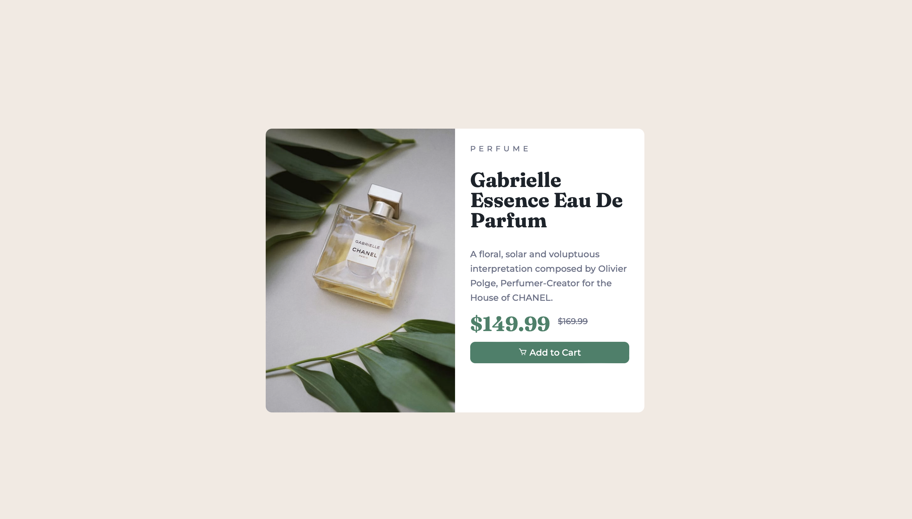
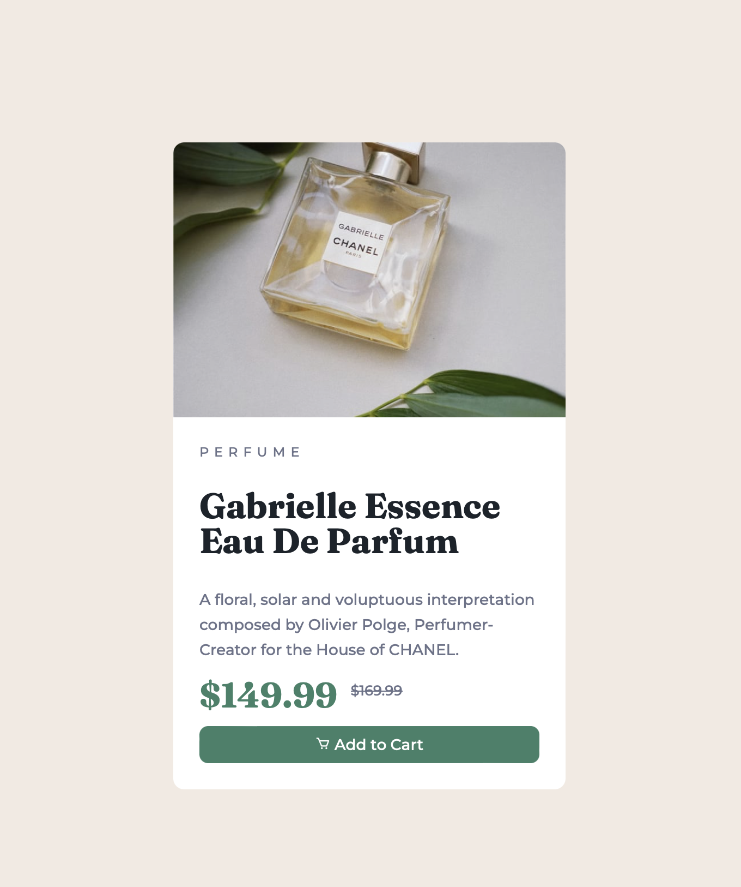

# Frontend Mentor - Product preview card component solution

This is a solution to the [Product preview card component challenge on Frontend Mentor](https://www.frontendmentor.io/challenges/product-preview-card-component-GO7UmttRfa). Frontend Mentor challenges help you improve your coding skills by building realistic projects.

## Table of contents

- [Overview](#overview)
  - [The challenge](#the-challenge)
  - [Screenshot](#screenshot)
  - [Links](#links)
- [My process](#my-process)
  - [Built with](#built-with)
  - [What I learned](#what-i-learned)
  - [Continued development](#continued-development)
  - [Useful resources](#useful-resources)
- [Author](#author)
- [Acknowledgments](#acknowledgments)

## Overview

### The challenge

Users should be able to:

- [x] View the optimal layout depending on their device's screen size
- [x] See hover and focus states for interactive elements

### Screenshot





### Links

- Solution URL: [https://www.frontendmentor.io/solutions/product-preview-vanilla-htmlcss-wyZqOB9_gd](https://www.frontendmentor.io/solutions/product-preview-vanilla-htmlcss-wyZqOB9_gd)
- Live Site URL: [https://cchivers.github.io/product-preview-card-component-main/](https://cchivers.github.io/product-preview-card-component-main/)

## My process

### Built with

- Semantic HTML5 markup
- CSS custom properties
- Mobile-first workflow

### What I learned

The biggest thing that I learned during this challenege was masking. My first attempt at this challenge I did `border-radius` for each change.

```css
img {
  border-top-left-radius: 10px;
  border-top-right-radius: 10px;
}
```

After a little help I was shown how to use the mask feature so that I did not have to do this based on the size of the screen, using `@media`

```css
.card {
  overflow: hidden;
}
```

### Continued development

Want to work on better responsive controls and were I need to find breaks and smoother transitions between said responsive modes.

### Useful resources

- [MDN](https://developer.mozilla.org/en-US/) - Only resouce used during this challenge was MDN.

## Author

- Frontend Mentor - [@cchivers](https://www.frontendmentor.io/profile/cchivers)

## Acknowledgments

Big thanks to [@kyusufm](https://www.frontendmentor.io/profile/kyusufm)

@kyusufm assisted me in getting my responsive design to change image. I was using the mobile image even for the desktop side.

@kyusufm also helped out with masking issues and showed me how to properly `overflow: hidden` as I was placing that on my img and not on the .card.
